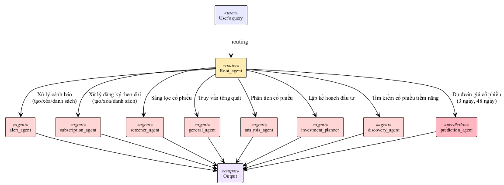
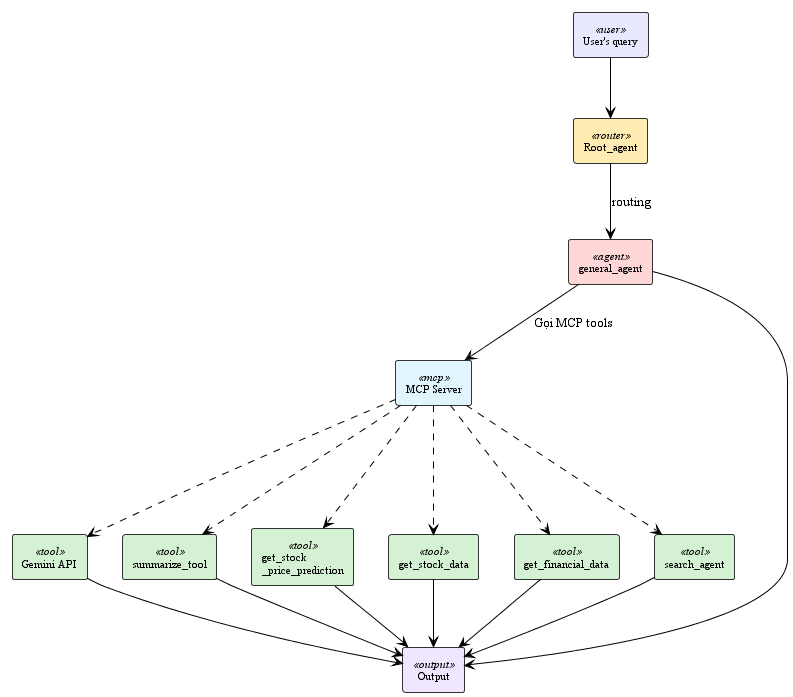
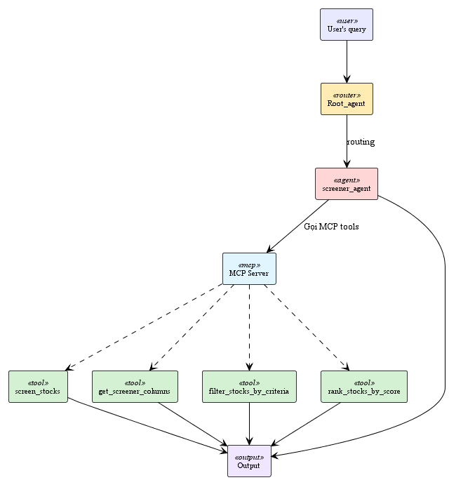
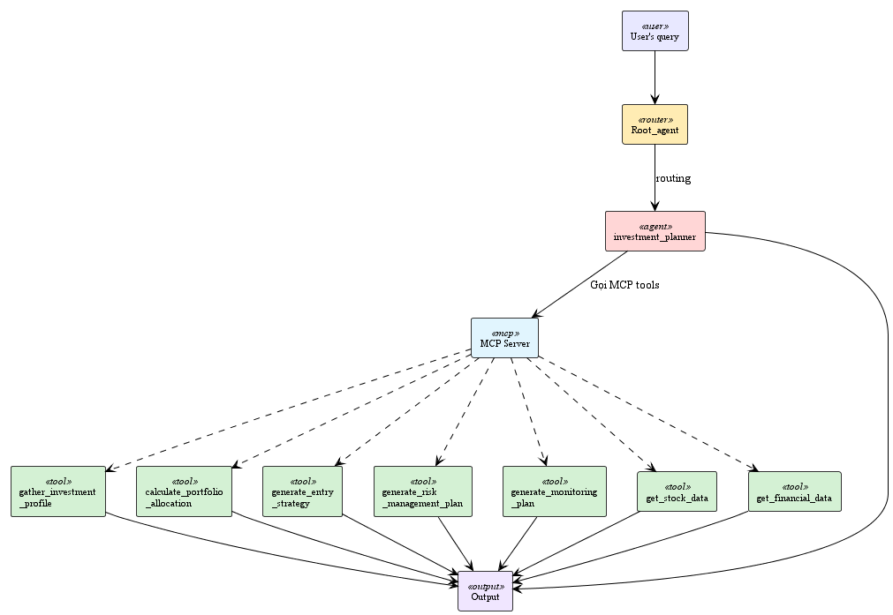
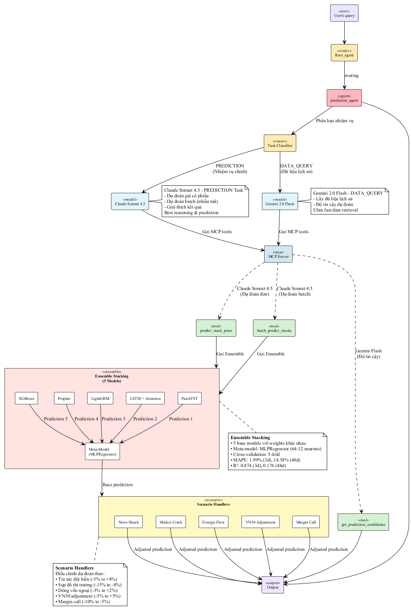

# BÁO CÁO HỆ THỐNG ĐA TÁC NHÂN CHO TƯ VẤN ĐẦU TƯ CHỨNG KHOÁN

## 3.4 Thiết kế hệ thống đa tác nhân cho trợ lý ảo

### 3.4.1 Kiến trúc tổng thể hệ thống đa tác nhân

*Hình 3.7: Kiến trúc tổng thể hệ thống đa tác nhân*

Hệ thống đa tác nhân được thiết kế theo kiến trúc phân cấp với **Root Agent** đóng vai trò điều phối trung tâm, chịu trách nhiệm phân tích yêu cầu của người dùng và định tuyến đến các agent chuyên biệt phù hợp. Kiến trúc này đảm bảo tính mô-đun, khả năng mở rộng và hiệu quả xử lý.

#### Các thành phần chính:

**Root Agent**: Agent gốc nhận yêu cầu từ người dùng, dựa vào hướng dẫn được xác định trước và phân tích ngữ cảnh và định tuyến đến agent con (sub agent) phù hợp.

**Alert Agent**: Chuyên xử lý các yêu cầu liên quan đến cảnh báo giá cổ phiếu, bao gồm tạo mới (create_alert), xóa cảnh báo (delete_alert) và xem danh sách (get_user_alerts)

**Subscription Agent**: Quản lý đăng ký theo dõi cổ phiếu của người dùng thông qua các công cụ create_subscription, delete_subscription và get_user_subscriptions.

**Screener Agent**: Thực hiện sàng lọc cổ phiếu dựa trên các tiêu chí kỹ thuật và tài chính thông qua công cụ vnstock_screener (lấy từ bộ lọc của TCBS thông qua API của thư viện vnstock), giúp người dùng tìm kiếm cơ hội đầu tư.

**General Agent**: Xử lý các câu hỏi tổng quát về thị trường chứng khoán, tích hợp với các agent con để thu thập dữ liệu giá cổ phiếu, thông tin tài chính và dự báo giá.

**Analysis Agent**: Chuyên về phân tích kỹ thuật và tài chính, cung cấp lời khuyên đầu tư dựa trên dữ liệu lịch sử, các chỉ báo kỹ thuật và tin tức liên quan tới công ty và thị trường.

**Investment Planner**: Agent lập kế hoạch đầu tư, cung cấp tư vấn đầu tư toàn diện bao gồm phân bổ danh mục, chiến lược vào lệnh, quản lý rủi ro và kế hoạch theo dõi.

**Discovery Agent**: Chuyên tìm kiếm và khám phá cổ phiếu tiềm năng dựa trên hồ sơ đầu tư của người dùng, tích hợp với Search Agent và dữ liệu TCBS để phân tích cơ hội đầu tư.

**Prediction Agent**: Agent dự đoán giá cổ phiếu sử dụng hệ thống ensemble learning với 5 mô hình machine learning và scenario handlers để điều chỉnh dự đoán theo các tình huống thị trường đặc biệt.

#### Luồng xử lý:

Khi nhận được yêu cầu từ người dùng, Root Agent sử dụng khả năng hiểu ngôn ngữ tự nhiên để phân loại yêu cầu và chuyển tiếp đến agent chuyên biệt. Mỗi agent con có bộ công cụ (tools) riêng biệt để thực hiện các tác vụ cụ thể, đảm bảo hiệu quả và chính xác trong xử lý. Kết quả từ các agent con được tổng hợp và trả về cho người dùng thông qua Root Agent, tạo ra trải nghiệm nhất quán và toàn diện.

### 3.4.2 Base Agents - Các agent nền tảng

Các Base Agents cung cấp những chức năng thiết yếu cho hệ thống tư vấn chứng khoán, bao gồm thu thập, xử lý và lưu trữ dữ liệu chứng khoán, thông tin tài chính và tin tức thị trường. Các tác nhân này được xây dựng theo nguyên tắc Agent-as-a-Tool, hoạt động độc lập và tái sử dụng linh hoạt bởi các tác nhân cấp cao hơn thông qua cơ chế AgentTool.

#### Search Agent

**Search Agent** sử dụng công cụ Google Search tích hợp trong ADK để tìm kiếm thông tin trực tuyến nhanh chóng và chính xác.

**Chức năng**: Tìm kiếm thông tin về doanh nghiệp, tin tức ngành công nghiệp, thị trường tài chính và kinh tế vĩ mô.

**Đầu vào**: Query/prompt của người dùng hoặc từ các agent khác

**Đầu ra**: Thông tin được tóm tắt và xác thực từ nhiều nguồn tin cậy

#### News Agent

**News Agent** thu thập và phân tích tin tức liên quan đến cổ phiếu, ngành công nghiệp, thị trường tài chính và kinh tế vĩ mô. Agent này kết hợp với Search Agent để lấy dữ liệu và lưu trữ vào State dưới định danh news_report_{symbol}.

**Chức năng**:

- Theo dõi tin tức thời gian thực
- Phân tích sentiment (tích cực/tiêu cực/trung lập)
- Đánh giá tác động của tin tức đến giá cổ phiếu

**Đầu vào**: Mã cổ phiếu (ticker) hoặc chủ đề cần theo dõi

**Đầu ra**: Báo cáo tin tức với sentiment analysis và mức độ ảnh hưởng

#### Stock Data Fetcher Agent

**Stock Data Fetcher Agent** xử lý các yêu cầu về dữ liệu lịch sử giá cổ phiếu và các chỉ báo kỹ thuật như MA, RSI, MACD, Bollinger Bands, khối lượng trung bình. Agent phân tích yêu cầu từ người dùng, xác định khoảng thời gian và dữ liệu phù hợp, lưu vào Session State với key stock_data_{symbol}.

**Chức năng**:

- Lấy dữ liệu OHLCV (Open, High, Low, Close, Volume)
- Tính toán các chỉ báo kỹ thuật: MA(20,50,200), RSI(14), MACD(12,26,9), Bollinger Bands(20,2)
- Cung cấp dữ liệu theo timeframe linh hoạt (1d, 1h, 5m, ...)

**Đầu vào**: Mã cổ phiếu, khoảng thời gian, các chỉ báo kỹ thuật cần tính toán

**Đầu ra**: DataFrame chứa dữ liệu lịch sử giá và các chỉ báo kỹ thuật

#### Financial Data Fetcher Agent

**Financial Data Fetcher Agent** chuyên thu thập các dữ liệu tài chính bao gồm bảng cân đối kế toán, báo cáo kết quả kinh doanh, lưu chuyển tiền tệ và các chỉ số tài chính quan trọng. Agent phân tích yêu cầu, lựa chọn chính xác dữ liệu từ cơ sở dữ liệu, lưu vào các Session State riêng biệt như balance_sheet_{symbol}, income_statement_{symbol}, hỗ trợ quá trình so sánh và đánh giá tài chính.

**Chức năng**:

- Thu thập báo cáo tài chính quý/năm
- Tính toán các chỉ số: ROE, ROA, EPS, P/E, P/B, Debt-to-Equity
- Phân tích xu hướng tăng trưởng doanh thu, lợi nhuận

**Đầu vào**: Mã cổ phiếu, loại báo cáo (balance sheet, income statement, cash flow), kỳ báo cáo

**Đầu ra**: Dữ liệu tài chính chuẩn hóa với các chỉ số quan trọng

#### Chart Fetcher Agent

**Chart Fetcher Agent** dựa vào dữ liệu giá lịch sử được lấy theo yêu cầu người dùng, agent này tiến hành vẽ biểu đồ giá và khối lượng. Dữ liệu hình ảnh được lưu tạm thời, đường dẫn ghi vào State để sử dụng trong phân tích chuyên sâu.

**Chức năng**:

- Vẽ biểu đồ nến (candlestick chart)
- Hiển thị các chỉ báo kỹ thuật trên biểu đồ
- Tạo biểu đồ so sánh nhiều mã cổ phiếu

**Đầu vào**: Dữ liệu giá từ Stock Data Fetcher Agent, các chỉ báo cần hiển thị

**Đầu ra**: File ảnh biểu đồ (PNG/JPG) và đường dẫn lưu trữ

#### Stock Discovery Agent

**Stock Discovery Agent** có nhiệm vụ sàng lọc cổ phiếu phù hợp với mong muốn đầu tư của người dùng. Cụ thể, từ mục tiêu, tiêu chí đầu tư, agent sẽ gọi search agent để tìm kiếm các cổ phiếu tiềm năng. Số lượng cổ phiếu tiềm năng sẽ luôn nhiều hơn số lượng người người dùng yêu cầu. Nếu người dùng không yêu cầu số lượng cụ thể thì sẽ trả về 10 mã tiên năng. Sau đó, agent sẽ lấy dữ liệu từ bộ lọc của TCBS để có các trường thông tin về các mã trên như roe, alpha, eps, revenue_growth_1y, rsi14, avg_trading_value_10d, vol_vs_sma20, ...Kết hợp 2 nguồn thông tin tìm kiếm và từ TCBS, agent sẽ đề xuất ra cổ phiếu phù hợp nhất với mong muốn đầu tư của người dùng.

**Chức năng**:

- Phân tích hồ sơ đầu tư: mức độ chấp nhận rủi ro, mục tiêu lợi nhuận, ngành ưa thích
- Sàng lọc cổ phiếu dựa trên nhiều tiêu chí kỹ thuật và tài chính
- Xếp hạng và đề xuất top cổ phiếu phù hợp

**Đầu vào**: Hồ sơ đầu tư của người dùng, các tiêu chí lọc

**Đầu ra**: Danh sách các cổ phiếu được xếp hạng với lý do đề xuất

### 3.4.3 General Agent - Agent xử lý tổng quát

*Hình 3.9: General Agent*

**General Agent** chịu trách nhiệm xử lý các truy vấn cơ bản về thị trường chứng khoán, bao gồm dữ liệu giá cổ phiếu, thông tin tài chính, dự báo ngắn hạn trong 3 phiên tới và các thông tin tổng quát khác.

#### Quy trình hoạt động của General Agent:

General Agent sẽ phân tích yêu cầu của người dùng, lựa chọn các tool phù hợp để thu thập thông tin và đưa ra câu trả lời. Nếu những câu hỏi liên quan tới giá cổ phiếu hoặc tài chính doanh nghiệp (không có dự báo giá) thì sau khi thu thập dữ liệu, agent này sẽ dùng data_summary_tool để tổng hợp thông tin. Việc sử dụng tool này sẽ giúp general agent có thể tổng hợp thông tin từ nhiều mã cổ phiếu cùng 1 lúc, giúp tối ưu thời gian đưa ra câu trả lời. Việc của nó là chỉ cần đưa ra câu trả lời phù hợp từ thông tin tổng hợp được trả về từ data_summary_tool.

#### Kiến trúc Multi-Model:

General Agent sử dụng Task Classifier để phân loại nhiệm vụ và routing đến AI model phù hợp:

**Gemini 2.0 Flash (DATA_QUERY/CONVERSATION)**:

- Xử lý truy vấn giá cổ phiếu, thông tin cơ bản
- Tìm kiếm đơn giản
- Hội thoại chung
- Ultra fast, ultra cheap

**Claude Sonnet 4.5 (ANALYSIS)**:

- Phân tích kỹ thuật phức tạp
- Best reasoning for complex analysis

#### Các công cụ chính:

**get_stock_price**: Lấy giá cổ phiếu hiện tại và lịch sử (Gemini Flash)

**get_stock_info**: Thu thập thông tin cơ bản về cổ phiếu (Gemini Flash)

**search_stocks**: Tìm kiếm cổ phiếu theo tiêu chí (Gemini Flash)

**analyze_stock_technical**: Phân tích kỹ thuật chuyên sâu (Claude Sonnet 4.5)

#### Đầu vào:

- Câu hỏi tổng quát từ người dùng
- Mã cổ phiếu (nếu có)

#### Đầu ra:

- Thông tin được tổng hợp và trình bày rõ ràng
- Dữ liệu kèm theo giải thích

### 3.4.4 Screener Agent - Agent sàng lọc cổ phiếu

**Screener Agent** là tác nhân chuyên dụng để sàng lọc cổ phiếu theo các tiêu chí kỹ thuật và tài chính, sử dụng dữ liệu từ bộ lọc TCBS thông qua thư viện vnstock. Với khả năng xử lý đến 81 tiêu chí lọc, tác nhân này linh hoạt chuyển đổi yêu cầu người dùng thành các tham số phù hợp để tìm kiếm các cổ phiếu tiềm năng nhất.

#### Các đặc điểm nổi bật của Screener Agent:

- Tự động ưu tiên xếp hạng cổ phiếu theo thanh khoản trung bình 20 ngày nếu người dùng không chỉ định ưu tiên cụ thể.
- Giới hạn tối đa 20 cổ phiếu để tránh kết quả trả về quá lớn, giúp người dùng dễ dàng lựa chọn.
- Có khả năng đưa ra các khuyến nghị điều chỉnh hoặc nới lỏng điều kiện lọc khi không tìm được cổ phiếu thỏa mãn, đảm bảo người dùng luôn có giải pháp đầu tư phù hợp.

#### Kiến trúc Multi-Model:

Screener Agent sử dụng Task Classifier để phân loại nhiệm vụ:

**Claude Sonnet 4.5 (SCREENING)**:

- Sàng lọc cổ phiếu với logic phức tạp
- Lọc theo điều kiện kết hợp
- Xếp hạng theo điểm số tổng hợp
- Best reasoning for complex screening

**Gemini 2.0 Flash (DATA_QUERY)**:

- Truy vấn thông tin cột dữ liệu
- Ultra fast data retrieval

#### Các công cụ chính:

**screen_stocks**: Công cụ chính để thực hiện sàng lọc theo tiêu chí (Claude Sonnet 4.5)

**get_columns**: Lấy danh sách 81 tiêu chí lọc có sẵn (Gemini Flash)

**filter_stocks**: Lọc chi tiết theo nhiều điều kiện kết hợp (Claude Sonnet 4.5)

**rank_stocks_by_score**: Xếp hạng kết quả theo điểm số ưu tiên (Claude Sonnet 4.5)

#### Các tiêu chí sàng lọc phổ biến:

**Tiêu chí kỹ thuật**:

- RSI (14): Chỉ báo sức mạnh tương đối
- MACD: Hội tụ phân kỳ trung bình động
- Bollinger Bands: Biên độ dao động giá
- Volume vs MA(20): So sánh khối lượng với trung bình
- Moving Averages: MA(20), MA(50), MA(200)

**Tiêu chí tài chính**:

- P/E ratio: Tỷ số giá trên thu nhập
- ROE: Tỷ suất sinh lời trên vốn chủ sở hữu
- ROA: Tỷ suất sinh lời trên tổng tài sản
- EPS growth: Tăng trưởng thu nhập trên cổ phiếu
- Debt-to-Equity: Tỷ lệ nợ trên vốn chủ sở hữu

**Tiêu chí thị trường**:

- Market Cap: Vốn hóa thị trường
- Average Trading Value (20d): Giá trị giao dịch trung bình
- Foreign Ownership: Tỷ lệ sở hữu nước ngoài
- Price Change: Biến động giá theo thời gian

#### Đầu vào:

- Các tiêu chí lọc do người dùng chỉ định
- Số lượng kết quả mong muốn (mặc định 20)

#### Đầu ra:

- Danh sách cổ phiếu đáp ứng tiêu chí
- Điểm số xếp hạng cho từng cổ phiếu
- Khuyến nghị điều chỉnh nếu không tìm thấy kết quả

### 3.4.5 Analysis Agent - Agent phân tích chuyên sâu

*Hình 3.10: Analysis Agent*

**Analysis Agent** là một tác nhân chuyên biệt, được thiết kế để cung cấp các phân tích toàn diện về cổ phiếu, kết hợp cả dữ liệu kỹ thuật, tài chính và thông tin thị trường. Ngoài ra agent này còn có thể tìm những cổ phiếu phù hợp với mục đích đầu tư của bạn và thực hiện phân tích các cổ phiếu này, từ đó đưa ra các đánh giá và khuyến nghị đầu tư chính xác và chi tiết.

#### Các chế độ phân tích chính:

**Phân tích kỹ thuật (Technical Analysis)**: Analysis Agent thu thập dữ liệu giá lịch sử và các chỉ báo kỹ thuật (MA, RSI, MACD, Bollinger Bands) thông qua Stock Data Fetcher Agent, đồng thời lấy biểu đồ kỹ thuật từ Chart Fetcher Agent. Agent sử dụng khả năng phân tích hình ảnh của Gemini để nhận diện các mô hình giá, xác định xu hướng, mức hỗ trợ và kháng cự, cũng như các tín hiệu mua/bán tiềm năng.

**Phân tích tài chính (Financial Analysis)**: Agent này lấy các báo cáo tài chính (bảng cân đối kế toán, báo cáo kết quả kinh doanh, lưu chuyển tiền tệ) và các chỉ số tài chính quan trọng (ROE, ROA, EPS, P/E) thông qua Financial Data Fetcher Agent. Dựa trên dữ liệu này, Analysis Agent đánh giá sức khỏe tài chính, khả năng sinh lời, tăng trưởng và so sánh hiệu quả hoạt động với các doanh nghiệp cùng ngành.

**Phân tích tổng hợp (Comprehensive Analysis)**: Kết hợp cả phân tích kỹ thuật và tài chính, đồng thời bổ sung thông tin thị trường và tin tức từ News Agent, Analysis Agent cung cấp một cái nhìn toàn diện về cổ phiếu. Agent đánh giá cả yếu tố cơ bản (fundamentals) và kỹ thuật (technicals), đồng thời xem xét các yếu tố vĩ mô và tin tức thị trường để đưa ra nhận định sâu sắc và toàn diện.

**Tư vấn đầu tư (Investment Advisory)**: Agent có thể nhận diện các yêu cầu đầu tư, thu thập nhu cầu đầu tư của người dùng qua các câu hỏi nếu người dùng chưa cung cấp. Trong trường hợp người dùng chưa đưa ra danh sách các cổ phiếu cần lên kế hoạch đầu tư, agent sẽ gọi tới stock discovery agent để hỗ trợ tìm ra các cổ phiếu phù hợp. Sau khi có danh sách, agent sẽ tiến hành phân tích cổ phiếu kèm với dự đoán giá cổ phiếu trong các phiên tới và đưa ra chiến lược đầu tư cho người dùng.

#### Kiến trúc Multi-Model:

Analysis Agent sử dụng Task Classifier để tối ưu hiệu suất:

**Claude Sonnet 4.5 (ANALYSIS)**:

- Phân tích kỹ thuật chuyên sâu
- Phân tích cơ bản (fundamental analysis)
- So sánh cổ phiếu
- Best reasoning & deep analysis

**Gemini 2.0 Flash (DATA_QUERY)**:

- Truy xuất dữ liệu cổ phiếu nhanh
- Ultra fast data retrieval

#### Các công cụ chính:

**analyze_stock_technical**: Phân tích kỹ thuật toàn diện (Claude Sonnet 4.5)

**analyze_stock_fundamental**: Phân tích cơ bản về tài chính doanh nghiệp (Claude Sonnet 4.5)

**compare_stocks**: So sánh nhiều cổ phiếu cùng lúc (Claude Sonnet 4.5)

**get_stock_data**: Thu thập dữ liệu giá lịch sử nhanh chóng (Gemini Flash)

#### Quy trình phân tích:

1. **Thu thập dữ liệu**: Agent thu thập tất cả dữ liệu cần thiết từ các nguồn khác nhau
2. **Phân tích kỹ thuật**: Đánh giá xu hướng, mô hình giá, tín hiệu kỹ thuật
3. **Phân tích tài chính**: Đánh giá sức khỏe tài chính, khả năng sinh lời
4. **Phân tích tin tức**: Đánh giá tác động của tin tức và sentiment thị trường
5. **Tổng hợp và đề xuất**: Kết hợp tất cả phân tích để đưa ra khuyến nghị đầu tư

#### Đầu vào:

- Mã cổ phiếu cần phân tích
- Loại phân tích mong muốn (kỹ thuật/tài chính/tổng hợp)
- Hồ sơ đầu tư (cho tư vấn đầu tư)

#### Đầu ra:

- Báo cáo phân tích chi tiết với các chỉ số quan trọng
- Biểu đồ trực quan hóa dữ liệu
- Khuyến nghị đầu tư cụ thể (Mua/Giữ/Bán)
- Mức giá mục tiêu và điểm dừng lỗ

### 3.4.6 Investment Planner - Agent lập kế hoạch đầu tư

**Investment Planner** là agent chuyên biệt cung cấp dịch vụ tư vấn đầu tư toàn diện, giúp người dùng xây dựng kế hoạch đầu tư chi tiết từ việc thu thập hồ sơ đầu tư, phân bổ danh mục, chiến lược vào lệnh đến quản lý rủi ro và theo dõi đầu tư.

#### Kiến trúc Multi-Model:

Investment Planner sử dụng 3 AI models với phân công nhiệm vụ cụ thể:

**GPT-4o (ADVISORY)**:

- Thu thập hồ sơ đầu tư
- Tính toán phân bổ danh mục
- Quản lý rủi ro
- Creative, advisory planning

**Claude Sonnet 4.5 (ANALYSIS)**:

- Phân tích chiến lược vào lệnh
- Xây dựng kế hoạch giám sát
- Best reasoning & analysis

**Gemini 2.0 Flash (DATA_QUERY)**:

- Truy xuất dữ liệu cổ phiếu
- Lấy dữ liệu tài chính
- Ultra fast data retrieval

#### Các chức năng chính:

**gather_investment_profile**: Thu thập thông tin về mục tiêu đầu tư, khả năng chấp nhận rủi ro, vốn đầu tư, thời gian đầu tư và sở thích ngành (GPT-4o)

**calculate_portfolio_allocation**: Tính toán phân bổ danh mục tối ưu dựa trên hồ sơ đầu tư và phân tích rủi ro-lợi nhuận (GPT-4o)

**generate_entry_strategy**: Đề xuất chiến lược vào lệnh chi tiết bao gồm điểm mua, khối lượng và thời điểm (Claude Sonnet 4.5)

**generate_risk_management_plan**: Xây dựng kế hoạch quản lý rủi ro với điểm cắt lỗ, chốt lời và tỷ lệ rủi ro/lợi nhuận (GPT-4o)

**generate_monitoring_plan**: Tạo kế hoạch theo dõi đầu tư định kỳ với các chỉ số cần giám sát (Claude Sonnet 4.5)

**get_stock_data**: Lấy dữ liệu giá lịch sử để phân tích và lập kế hoạch (Gemini Flash)

**get_financial_data**: Thu thập dữ liệu tài chính để đánh giá chất lượng cổ phiếu (Gemini Flash)

#### Quy trình lập kế hoạch đầu tư:

1. **Thu thập hồ sơ đầu tư**: Agent tương tác với người dùng để hiểu rõ mục tiêu, khả năng tài chính và sở thích đầu tư
2. **Phân tích và lựa chọn cổ phiếu**: Sử dụng stock discovery agent để tìm kiếm cổ phiếu phù hợp hoặc phân tích danh sách do người dùng cung cấp
3. **Phân bổ danh mục**: Tính toán tỷ trọng từng cổ phiếu dựa trên rủi ro, lợi nhuận kỳ vọng và tương quan
4. **Chiến lược vào lệnh**: Đề xuất điểm mua, khối lượng từng lệnh và thời điểm thực hiện
5. **Quản lý rủi ro**: Xác định điểm cắt lỗ, chốt lời cho từng cổ phiếu và toàn bộ danh mục
6. **Kế hoạch theo dõi**: Hướng dẫn cách theo dõi và điều chỉnh danh mục định kỳ

#### Đầu vào:

- Hồ sơ đầu tư của người dùng
- Danh sách cổ phiếu quan tâm (tùy chọn)
- Số vốn đầu tư

#### Đầu ra:

- Kế hoạch đầu tư toàn diện với phân bổ danh mục cụ thể
- Chiến lược vào lệnh chi tiết cho từng cổ phiếu
- Kế hoạch quản lý rủi ro và điểm dừng lỗ
- Hướng dẫn theo dõi và điều chỉnh danh mục

### 3.4.7 Discovery Agent - Agent tìm kiếm cổ phiếu tiềm năng

**Discovery Agent** chuyên về việc tìm kiếm và khám phá các cổ phiếu tiềm năng phù hợp với hồ sơ đầu tư của người dùng. Agent này kết hợp nhiều nguồn dữ liệu và phương pháp phân tích để đưa ra danh sách cổ phiếu được đánh giá cao.

#### Kiến trúc Multi-Model:

Discovery Agent sử dụng AI model mạnh nhất cho nhiệm vụ khám phá:

**Claude Opus 4.5 (DISCOVERY)**:

- Khám phá cổ phiếu tiềm năng với phân tích sâu
- Tìm kiếm theo ngành công nghiệp
- Tìm kiếm đa nguồn (TCBS, Gemini Search)
- Most powerful, deepest analysis

**Gemini 2.0 Flash (DATA_QUERY)**:

- Truy xuất dữ liệu cổ phiếu nhanh
- Ultra fast data retrieval

#### Các công cụ chính:

**discover_stocks**: Khám phá cổ phiếu dựa trên hồ sơ đầu tư chi tiết (Claude Opus 4.5)

**search_stocks_by_sector**: Tìm kiếm cổ phiếu tiềm năng theo ngành (Claude Opus 4.5)

**search_tcbs**: Tìm kiếm thông tin từ bộ lọc TCBS với 81 tiêu chí (Claude Opus 4.5)

**search_gemini**: Tìm kiếm và tóm tắt thông tin từ web (Claude Opus 4.5)

**get_stock_data**: Thu thập dữ liệu giá để phân tích bổ sung (Gemini Flash)

#### Quy trình tìm kiếm:

1. **Phân tích hồ sơ**: Hiểu rõ mục tiêu, rủi ro chấp nhận và sở thích của người dùng
2. **Tìm kiếm sơ bộ**: Sử dụng search agent để tìm nhiều cổ phiếu tiềm năng (thường gấp đôi số lượng yêu cầu)
3. **Thu thập dữ liệu TCBS**: Lấy 81 tiêu chí từ bộ lọc TCBS cho các cổ phiếu tiềm năng
4. **Phân tích và xếp hạng**: Kết hợp dữ liệu từ search và TCBS để xếp hạng theo mức độ phù hợp
5. **Đề xuất danh sách**: Trả về top cổ phiếu phù hợp nhất kèm lý do chi tiết

#### Đặc điểm nổi bật:

- Tìm kiếm thông minh dựa trên nhiều yếu tố: kỹ thuật, tài chính, tin tức, xu hướng ngành
- Tự động xếp hạng theo điểm số tổng hợp từ nhiều nguồn
- Cung cấp giải thích chi tiết cho mỗi đề xuất
- Mặc định trả về 10 cổ phiếu nếu người dùng không chỉ định

#### Đầu vào:

- Hồ sơ đầu tư của người dùng
- Số lượng cổ phiếu mong muốn (mặc định 10)

#### Đầu ra:

- Danh sách cổ phiếu được xếp hạng
- Điểm số đánh giá cho từng cổ phiếu
- Lý do chi tiết cho mỗi đề xuất
- Thông tin quan trọng từ TCBS và phân tích web

### 3.4.8 Prediction Agent - Agent dự đoán giá cổ phiếu

**Prediction Agent** là agent tiên tiến nhất trong hệ thống, chuyên về dự đoán giá cổ phiếu sử dụng kiến trúc hybrid multi-model với ensemble learning và scenario handlers. Agent này tích hợp 5 mô hình machine learning khác nhau và có khả năng điều chỉnh dự đoán theo các tình huống thị trường đặc biệt.

#### Kiến trúc Multi-Model:

Agent sử dụng hai AI model lớn với phân công nhiệm vụ rõ ràng:

**Claude Sonnet 4.5 (PREDICTION Task)**:

- Xử lý dự đoán giá cổ phiếu chính
- Dự đoán batch cho nhiều mã cổ phiếu
- Giải thích kết quả dự đoán chi tiết
- Tốt nhất cho reasoning và prediction phức tạp

**Gemini 2.0 Flash (DATA_QUERY Task)**:

- Truy xuất dữ liệu lịch sử siêu nhanh
- Tính toán độ tin cậy của dự đoán
- Xử lý queries đơn giản về dữ liệu
- Ultra fast data retrieval

#### Ensemble Stacking System:

Hệ thống ensemble bao gồm 2 cấp độ:

**Level 1 - Base Models (5 models)**:

1. **PatchTST (Transformer)**: Chuyên phát hiện các pattern dài hạn trong chuỗi thời gian
2. **LSTM + Attention (Deep Learning)**: Xử lý các phụ thuộc tuần tự với cơ chế attention
3. **LightGBM (Gradient Boosting)**: Nắm bắt mối quan hệ phi tuyến trong dữ liệu
4. **Prophet (Statistical)**: Phân tích xu hướng và tính mùa vụ
5. **XGBoost (Gradient Boosting)**: Xử lý các mối quan hệ phức tạp

**Level 2 - Meta-Model**:

- **MLPRegressor (Neural Network 64→32)**: Học các trọng số tối ưu cho mỗi base model
- Cross-validation: 5-fold để đảm bảo độ tin cậy
- **Hiệu suất**:
  - 3-day prediction: MAPE 1.99%, R² 0.874
  - 48-day prediction: MAPE 14.58%, R² 0.176

#### Scenario Handlers:

Hệ thống điều chỉnh dự đoán theo 5 tình huống đặc biệt:

**News Shock Handler**:

- Phát hiện tin tức đột biến tích cực/tiêu cực
- Điều chỉnh: -5% đến +8% tùy mức độ impact

**Market Crash Handler**:

- Nhận diện sụp đổ thị trường
- Điều chỉnh: -15% đến -8%

**Foreign Flow Handler**:

- Theo dõi dòng vốn ngoại mua/bán ròng
- Điều chỉnh: -3% đến +2%

**VN30 Adjustment Handler**:

- Xử lý hiệu ứng khi cổ phiếu vào/ra rổ VN30
- Điều chỉnh: -5% đến +5%

**Margin Call Handler**:

- Phát hiện nguy cơ margin call ảnh hưởng
- Điều chỉnh: -10% đến -5%

#### Các công cụ chính:

**predict_stock_price**: Dự đoán giá một mã cổ phiếu cụ thể (3-day hoặc 48-day)

**batch_predict_stocks**: Dự đoán đồng loạt nhiều mã cổ phiếu để tối ưu thời gian

**get_prediction_confidence**: Tính toán độ tin cậy và khoảng tin cậy của dự đoán

#### Quy trình dự đoán:

1. **Phân loại nhiệm vụ**: Task Classifier xác định loại request (PREDICTION hoặc DATA_QUERY)
2. **Routing đến model phù hợp**:

   - PREDICTION → Claude Sonnet 4.5
   - DATA_QUERY → Gemini 2.0 Flash
3. **Gọi MCP tools**: Model tương ứng gọi các prediction tools
4. **Ensemble prediction**:

   - 5 base models tạo ra predictions độc lập
   - Meta-model kết hợp predictions với trọng số tối ưu
5. **Scenario adjustment**:

   - Phát hiện các tình huống đặc biệt
   - Điều chỉnh dự đoán theo scenario handlers
6. **Tính độ tin cậy**: Gemini Flash tính confidence interval
7. **Trả kết quả**: Kết quả cuối cùng bao gồm dự đoán, độ tin cậy và giải thích

#### Đầu vào:

- Mã cổ phiếu (ticker)
- Horizon: "3day" hoặc "48day"
- Dữ liệu lịch sử và tin tức thị trường

#### Đầu ra:

- Giá dự đoán cho các phiên tương lai
- Độ tin cậy và khoảng tin cậy (confidence interval)
- Giải thích chi tiết về dự đoán
- Cảnh báo về các rủi ro và yếu tố ảnh hưởng

#### Ưu điểm vượt trội:

1. **Độ chính xác cao**: MAPE 1.99% cho dự đoán ngắn hạn
2. **Đa dạng mô hình**: 5 models khác nhau bổ trợ cho nhau
3. **Adaptive**: Tự động điều chỉnh theo tình huống thị trường
4. **Scalable**: Có thể dự đoán batch nhiều mã cổ phiếu
5. **Explainable**: Cung cấp giải thích chi tiết cho từng dự đoán

### 3.4.9 Alert Agent & Subscription Agent

#### Alert Agent

**Alert Agent** quản lý hệ thống cảnh báo giá cổ phiếu cho người dùng.

**Các công cụ**:

- **create_alert**: Tạo cảnh báo mới với điều kiện giá
- **get_user_alerts**: Xem danh sách cảnh báo hiện tại
- **delete_alert**: Xóa cảnh báo không còn cần thiết

**Chức năng**: Giúp người dùng theo dõi giá cổ phiếu và nhận thông báo khi đạt mức giá mong muốn.

#### Subscription Agent

**Subscription Agent** quản lý đăng ký theo dõi cổ phiếu của người dùng.

**Các công cụ**:

- **create_subscription**: Đăng ký theo dõi cổ phiếu mới
- **get_user_subscriptions**: Xem danh sách theo dõi
- **delete_subscription**: Hủy đăng ký theo dõi

**Chức năng**: Cho phép người dùng quản lý danh mục cổ phiếu quan tâm và nhận cập nhật thường xuyên.

### 3.4.10 Điểm nổi bật của hệ thống đa tác nhân chuyên biệt

Hệ thống đa tác nhân được phát triển trong phạm vi báo cáo này sở hữu một số điểm nổi bật so với các hệ thống đa tác nhân không chuyên biệt cho lĩnh vực phân tích và tư vấn đầu tư chứng khoán:

#### 1. Hệ thống dữ liệu chuyên biệt

Hệ thống được xây dựng trên nền tảng dữ liệu lịch sử giá cổ phiếu được lưu trữ qua nhiều năm, kèm theo các chỉ báo kỹ thuật đã được tính toán sẵn như RSI, MACD, khối lượng trung bình... Đặc biệt, dữ liệu giá được thu thập và lưu trữ theo khung thời gian phút, cho phép phân tích linh hoạt ở nhiều cấp độ thời gian - điều mà các hệ thống không chuyên biệt thường không hỗ trợ (chỉ dùng lại ở khung ngày).

Ngoài ra, hệ thống còn lưu trữ đầy đủ các chỉ số tài chính hàng quý như EPS, ROA, ROE, EBITDA,... và nhiều chỉ số khác được trích xuất từ báo cáo tài chính doanh nghiệp, hỗ trợ phân tích tài chính chuyên sâu.

#### 2. Khả năng tìm kiếm và thu thập thông tin

Được tích hợp công cụ tìm kiếm Google Search trong ADK, hệ thống có thể chủ động thu thập và tổng hợp thông tin từ nhiều nguồn đáng tin cậy khác nhau. Nhờ đó, việc truy xuất dữ liệu liên quan đến doanh nghiệp, thị trường và các yếu tố kinh tế vĩ mô trở nên nhanh chóng, đầy đủ và chính xác - đóng vai trò quan trọng trong phân tích và ra quyết định đầu tư.

#### 3. Công cụ tính toán và phân tích chuyên sâu

Hệ thống hỗ trợ tính toán các chỉ báo kỹ thuật theo nhiều khung thời gian khác nhau dựa trên dữ liệu lịch sử đã lưu trữ. Các chỉ báo như MA, Bollinger Bands, RSI, MACD, khối lượng trung bình,... được hệ thống tự động xử lý, cho phép phân tích kỹ thuật diễn ra một cách toàn diện, trực quan và hiệu quả hơn.

#### 4. Hệ thống tổng hợp và phân tích dữ liệu đa chiều

Hệ thống sở hữu khả năng Business Intelligence (BI) và phân tích thống kê mạnh mẽ, có thể tổng hợp và xử lý dữ liệu từ nhiều nguồn khác nhau để tạo ra những báo cáo phân tích toàn diện và sâu sắc. Cụ thể:

**Phân tích xu hướng dựa trên biểu đồ giá**: Hệ thống có khả năng thu thập và xử lý dữ liệu hình ảnh từ biểu đồ giá chứng khoán để nhận diện các mô hình kỹ thuật như mô hình vai đầu vai, mô hình tam giác, kênh giá, và các vùng hỗ trợ/kháng cự. Hệ thống có thể phân tích biểu đồ theo thời gian thực, phát hiện các tín hiệu đảo chiều hoặc tiếp diễn xu hướng, từ đó hỗ trợ nhà đầu tư đưa ra quyết định mua/bán một cách nhanh chóng và chính xác hơn. Các tín hiệu được kết hợp với dữ liệu định lượng và định tính để tăng độ tin cậy và giảm thiểu nhiễu trong quá trình phân tích xu hướng.

**Phân tích thống kê chuyên sâu**: Hệ thống thực hiện các phép tính thống kê phức tạp như phân tích tương quan giữa các cổ phiếu, tính toán độ biến động (volatility), phân tích xu hướng dài hạn và ngắn hạn, xác định các mô hình giá và khối lượng giao dịch.

**Screener Agent với khả năng BI**: Với hơn 40 tiêu chí lọc, Screener Agent không chỉ lọc cổ phiếu mà còn thực hiện phân tích thống kê để xếp hạng và so sánh hiệu suất của các cổ phiếu dựa trên nhiều tiêu chí như thanh khoản, tăng trưởng, định giá và rủi ro.

**Báo cáo tổng hợp thông minh**: Analysis Agent có khả năng tạo ra các báo cáo phân tích tổng hợp, kết hợp phân tích định lượng (số liệu thống kê, chỉ số tài chính) với phân tích định tính (tin tức, sentiment thị trường) để đưa ra những nhận định đầu tư có căn cứ khoa học.

#### 5. Dự báo giá cổ phiếu

Hệ thống tích hợp các mô hình dự báo sử dụng các thuật toán machine learning hiện đại, cho phép dự đoán xu hướng giá cổ phiếu trong ngắn hạn và trung hạn. Khi kết hợp với khả năng phân tích kỹ thuật và tài chính toàn diện, hệ thống có thể đưa ra khuyến nghị đầu tư mang tính cá nhân hóa cao, phù hợp với hồ sơ rủi ro và mục tiêu lợi nhuận của từng nhà đầu tư, góp phần tối ưu hóa hiệu quả đầu tư và chủ động kiểm soát rủi ro.

---

## Kết luận

Hệ thống đa tác nhân cho tư vấn đầu tư chứng khoán được thiết kế với kiến trúc phân tầng rõ ràng, tích hợp nhiều agent chuyên biệt với các chức năng bổ trợ lẫn nhau. Từ việc thu thập và phân tích dữ liệu, sàng lọc cổ phiếu, phân tích chuyên sâu đến dự đoán giá và lập kế hoạch đầu tư, hệ thống cung cấp một giải pháp toàn diện cho nhà đầu tư cá nhân.

Điểm mạnh của hệ thống nằm ở khả năng xử lý dữ liệu chuyên biệt, tích hợp nhiều nguồn thông tin, sử dụng AI models tiên tiến với phân công nhiệm vụ tối ưu, và đặc biệt là hệ thống dự đoán giá sử dụng ensemble learning kết hợp scenario handlers - một đột phá trong việc áp dụng machine learning cho thị trường chứng khoán Việt Nam.
