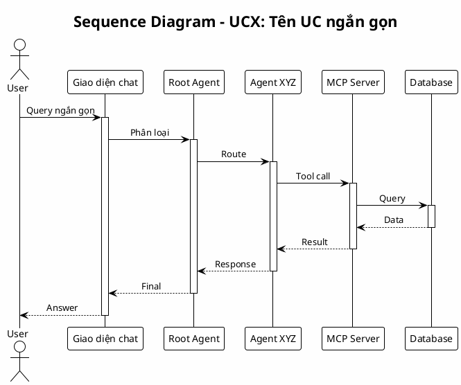

# 🎨 DIAGRAM OPTIMIZATION SUMMARY

> **Ngày**: 2026-01-07
> **Mục đích**: Tối ưu diagrams cho in ấn A4, đúng ký hiệu tài liệu

---

## Chiến lược tối ưu

### 1. Ký hiệu (theo tài liệu cũ)
- ✅ `actor` cho User (stick figure)
- ✅ `participant` cho tất cả components (circles)
- ❌ Không dùng `database`, `cloud` (PlantUML cũ không support tốt)

### 2. Layout
- **Ngắn (< 8 participants)**: Top to bottom (dọc)
- **Dài (>= 8 participants)**: Left to right (ngang) - quay trang

### 3. Content
- **Bỏ**: Notes dài, comments chi tiết
- **Giữ**: Flow chính, messages quan trọng
- **Đơn giản**: Activation bars, return messages

### 4. Diagrams cần optimize

| File | Participants | Layout | Action |
|------|-------------|--------|--------|
| UC1 | 7 | Dọc | ✅ Simple - giữ nguyên |
| UC2 | 8 | Ngang | 🔄 Optimize |
| UC3 | 8 | Ngang | 🔄 Optimize |
| UC4 | 8 | Ngang | 🔄 Optimize |
| UC5 | 7 | Dọc | 🔄 Simplify |
| UC6 | 12 | Ngang | 🔄 Optimize heavy |
| UC7 | 7 | Dọc | ✅ Simple - giữ nguyên |
| UC8 | 12 | Ngang | 🔄 Optimize heavy |
| UC9 | 11 | Ngang | 🔄 Optimize |

---

## Template tối ưu

---

**Status**: Ready to optimize
**Target**: Readable on A4 paper, clean layout

